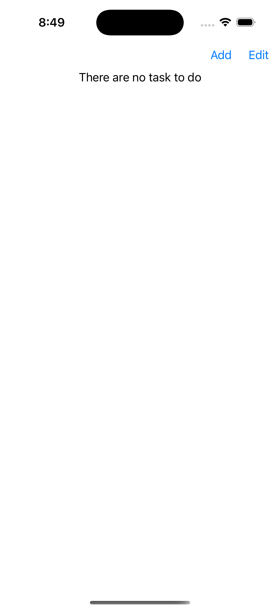

# Project Description

This application is used to create a list of todos. In this application you can create, edit, mark as complete and delete a todo. This is a simple project that will show us how to use MVVM pattern to complete a functionality and state manegement in iOS application.

## Architecture overview

In this application we are using the MVVM architecture pattern. This kind of architecture allow us to divide each responsibility bewtween Model, View and ViewModel. Let's see how do we used each component:
#### Model
In this component we defined the struct that will manage data. We define the properties that our todo will have.

#### View
In this component we defined the visual components that were are going to display in the screen. Each view defined only contains visual components and some statements that display component if the state of the conditional change. In the view we defined an ObjectObserved to keep allowed the viewModel doing changes to the list of todo were displaying in the view. Also we include some properties that we will track the State locally.

#### View Model
In this component we defined the way to track the state of the todo arrays object. We include the functionalites add, remove and load in this component to avoid including business logic in the View or Model components. We mark as @Published the arrays of todo properties to inform other components the changes.

## Usage Instructions
1. The Xcode version minimum to run the application is 16.0.

## Features 
### Add a new todo
Using the Add bottom in the toolbar of the application you can add a new ToDo.

Click the Add button:

Enter the todo's title and click Save:

### Mark or Unmark as complete
Using the square image at the end you can click to mark the todo as completed or remove the completed mark.

Click the Square image at the end of the list item:

This is an Example of a complete task (if you want to mark as uncomplete, click the square image again to remove the completion)

### Edit an existing todo
Using the Pencil Blue image at the end you can click to mark the todo as completed or remove the completed mark.

Click the Pencil Blue image at the end of the list item:

Enter the new todo's title and click Save:

### Swipe to Delete a Todo
If you Swipe to the left a todo item to enable the delete button

Click the Edit button image in the toolbar or swipe left any todo item:

Enter the new todo's title and click Save:

### Edit to enable bulk delete
If you click Edit button in the toolbar the bulk delete is enabled

Click the Edit button image in the toolbar or swipe left any todo item:

Click the red symbol in the todo item:

Enter the new todo's title and click Save:

